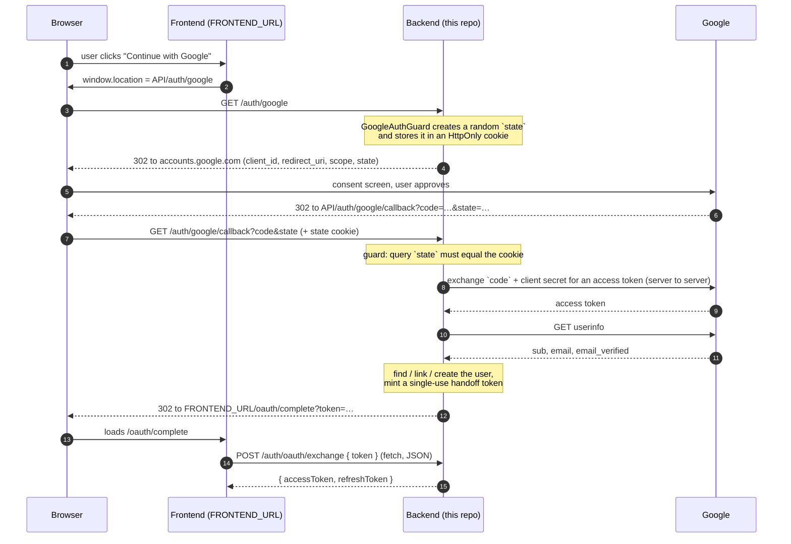

# touch-grass-back

NestJS backend for touch-grass.

## Project setup

```bash
pnpm install
```

You'll need a local Postgres reachable with the credentials in `.env` (copy `.env.example` to `.env` and fill it in). Then run migrations:

```bash
pnpm run migration:run
```

Run the app:

```bash
pnpm run start:dev   # watch mode
pnpm run start       # single run
pnpm run start:prod  # from a build (node dist/main)
```

Run tests:

```bash
pnpm run test        # unit tests
pnpm run test:e2e    # e2e tests (needs a reachable Postgres)
pnpm run test:cov    # unit tests with coverage
```

## Environment variables

All of these are required — the app validates them at boot (via a Joi schema) and refuses to start if any are missing.

| Variable | Description |
|---|---|
| `DB_HOST`, `DB_PORT`, `DB_USERNAME`, `DB_PASSWORD`, `DB_NAME` | Postgres connection |
| `JWT_SECRET` | Signing secret for access tokens |
| `JWT_ACCESS_TTL` | Access token lifetime (e.g. `15m`) |
| `JWT_REFRESH_TTL` | Refresh token lifetime (e.g. `30d`) |
| `PASSWORD_RESET_TTL` | How long a password-reset link stays valid (e.g. `15m`) |
| `OAUTH_LOGIN_TOKEN_TTL` | How long the short-lived, single-use OAuth login handoff token stays valid (e.g. `60s`). See [Sign in with Google](#sign-in-with-google-oauth). |
| `FRONTEND_URL` | Base URL of the frontend. Used to build the password-reset link (`${FRONTEND_URL}/reset-password?token=...`) **and** where the Google login redirects the browser afterwards (`${FRONTEND_URL}/oauth/complete?token=...` or `?error=...`). The scheme must match how the frontend is really served — `http://localhost:3000` locally, not `https://`, unless you run local HTTPS. |
| `CORS_ORIGINS` | **Comma-separated** list of allowed origins, e.g. `http://localhost:3000,https://app.touchgrass.com`. Not a JSON array — plain comma-separated string. |
| `BREVO_API_KEY` | API key for Brevo (transactional email provider), used to send password-reset emails |
| `MAIL_FROM_EMAIL`, `MAIL_FROM_NAME` | Sender identity for outgoing emails |
| `GOOGLE_OAUTH_CLIENT_ID`, `GOOGLE_OAUTH_CLIENT_SECRET` | Google OAuth 2.0 client credentials, from Google Cloud Console → APIs & Services → Credentials. The secret is the only real secret of the two — keep it out of git. |
| `GOOGLE_CALLBACK_URL` | The backend URL Google sends the user back to (e.g. `http://localhost:6767/auth/google/callback` locally). Must match, character for character, a redirect URI registered on the Google client, or Google shows `redirect_uri_mismatch`. |
| `PORT` | Optional, defaults to `6767` |
| `NODE_ENV` | Optional, defaults to `development`. Set to `production` to disable verbose validation-error debug messages and to mark the OAuth `state` cookie `Secure` (HTTPS only). |

## Authentication model

There are two ways to sign in — email + password, and Google — and **both end the same way**: the frontend holds an `{ accessToken, refreshToken }` pair and everything below applies identically to it.

- **Access tokens** are short-lived JWTs. Send them as `Authorization: Bearer <accessToken>` on any endpoint that requires auth. Don't try to decode/inspect them beyond that — treat as opaque from the frontend's perspective.
- **Refresh tokens** are opaque random strings (`id.secret` format internally, but the frontend should just treat the whole string as an opaque blob to store and send back). They are **single-use and rotate**: every call to `/auth/refresh` invalidates the token you sent and returns a brand-new `{ accessToken, refreshToken }` pair. Always persist the newest refresh token you receive — the old one stops working immediately after use.
- If a refresh token is reused after being invalidated (revoked or already-rotated), the backend treats that as a possible compromise and revokes **all** of that user's active refresh tokens — every session gets logged out, not just the one making the suspicious request.
- Resetting a password revokes all of the user's refresh tokens *and* invalidates any access token issued before the reset (even if that access token hasn't technically expired yet) — so a password reset is effectively an instant global logout.
- Standard error shape for all thrown exceptions (from Nest's default exception filter):
  ```json
  { "statusCode": 401, "message": "Invalid credentials", "error": "Unauthorized" }
  ```
  For validation errors (400s), `message` is an array of strings, one per failed field.
- Rate limiting: most routes allow 20 requests/minute per IP by default (this includes the two Google routes). `login` is capped at 5/minute, `forgot-password` at 3/15 minutes. Exceeding a limit returns `429 Too Many Requests` (except on `GET /auth/google/callback`, where it becomes a redirect — see [below](#get-authgooglecallback)).
- **Token ids are validated before any database lookup.** Every opaque token (`refresh`, reset, OAuth handoff) is `id.secret` where `id` is a UUID. A token whose `id` isn't a UUID is rejected as an invalid token (`401`, or `204` for `logout`) instead of reaching Postgres.
- **Accounts can have no password.** A user created through Google has `passwordHash = NULL` until they set one via *forgot password → reset password*. Password login for such an account returns the same generic `401 Invalid credentials`.

## Sign in with Google (OAuth)

This section explains the whole cycle **and why each piece exists**, so that changing one part doesn't silently break a security property. The per-endpoint reference is further down.

### For frontend developers (the short version)

1. Send the **browser itself** to `GET {API}/auth/google` — `window.location.href = ...` or a plain `<a href>`. **Not `fetch`/`axios`** (see [why](#2-the-state-cookie--protection-against-login-csrf)).
2. The user signs in at Google. Afterwards the browser lands on **`{FRONTEND_URL}/oauth/complete`** with either `?token=...` (success) or `?error=...` (failure).
3. On success, immediately `POST {API}/auth/oauth/exchange` with `{ "token": "..." }`. You get back the same `{ accessToken, refreshToken }` as `POST /auth/login`. From here on it's the normal session lifecycle.

A minimal `/oauth/complete` page:

```ts
const params = new URLSearchParams(window.location.search);
const error = params.get('error');   // access_denied | email_already_in_use | too_many_requests | oauth_failed
const token = params.get('token');

window.history.replaceState(null, '', window.location.pathname); // remove the token from the URL/history right away

if (error || !token) {
  // show a message for `error` and offer "try again"
} else {
  const res = await fetch(`${API_URL}/auth/oauth/exchange`, {
    method: 'POST',
    headers: { 'content-type': 'application/json' },
    body: JSON.stringify({ token }),
  });
  const { accessToken, refreshToken } = await res.json(); // store like a normal login
}
```

> **React/Next.js dev gotcha:** `<StrictMode>` runs effects twice in development. The handoff token is single-use, so the second `exchange` call gets `401 OAuth login token already used`. Guard the effect with a `useRef` flag so the exchange runs once.

### The full cycle



Where the code lives:

| Step | Code |
|---|---|
| Start + callback guard (`state` cookie) | `src/auth/guards/google-auth-guard.ts` |
| `code` → Google profile → `{ provider, providerAccountId, email, emailVerified }` | `src/auth/strategies/google.strategy.ts` (Passport `passport-google-oauth20`) |
| Find / link / create the user, mint the handoff token, redirect URL | `AuthService.findOrCreateOAuthUser`, `issueOAuthLoginToken`, `completeOAuthLogin` |
| Handoff token → real tokens | `AuthService.exchangeOAuthLoginToken` |
| Errors → redirect to the frontend | `src/auth/filters/oauth-callback-exception.filter.ts` |
| Cookie parsing | `app.use(cookieParser())` in `src/main.ts` |

### 1. Starting the flow — `GET /auth/google` (and why its handler is empty)

`AuthController.googleAuth()` has an empty body on purpose. The work happens in the **guard** (`@UseGuards(GoogleAuthGuard)`), which runs *before* the handler: it asks Passport's Google strategy to authenticate the request, and since the request carries no `code` yet, the strategy builds Google's consent URL and writes the `302` itself (`res.statusCode = 302; res.setHeader('Location', …); res.end()`). The response is already finished, so the handler never runs. The redirect URL comes from your config: `GOOGLE_OAUTH_CLIENT_ID`, `GOOGLE_CALLBACK_URL`, and the scopes `email profile`.

**Why the backend-driven "authorization code" flow, and not a Google button in the frontend?**
- The **client secret stays on the server**. The browser only ever sees the short-lived, single-use `code`, which is useless without the secret.
- The frontend needs no Google SDK, and adding another provider later means adding one Passport strategy, not reworking the frontend.
- Flows that return tokens directly in the browser URL (the "implicit" flow) are discouraged by current OAuth guidance because of exactly that exposure.

### 2. The `state` cookie — protection against login CSRF

Without a `state` check, this attack works: an attacker starts a Google login with **their own** Google account, stops before the last step, and keeps the URL `…/auth/google/callback?code=ATTACKERS_CODE`. They send that link to a victim. The victim's browser completes the callback and is logged in **as the attacker** — anything the victim then saves (profile, data, payment details) lands in the attacker's account.

`state` defeats that: when the flow starts, the backend generates a random value, sends it to Google (Google echoes it back on the callback), **and** stores it in a cookie in *that* browser. On the callback the two must match. A victim's browser never received the attacker's state cookie, so the forged link is rejected.

Details worth knowing:
- **Why a cookie and not a server-side session?** The API is stateless (`PassportModule.register({ session: false })`, Bearer tokens). A short-lived cookie keeps it that way — no session store to run or scale.
- Cookie: `google-oauth-state`, `HttpOnly` (JavaScript can't read it), `SameSite=Lax`, 5-minute lifetime, `Secure` when `NODE_ENV=production`, and it is **deleted on every callback** (single use).
- **Why `SameSite=Lax` and not `Strict`?** The callback is a *cross-site top-level navigation* coming from `accounts.google.com`. `Strict` would drop the cookie on exactly that request; `Lax` sends it.
- **Why the frontend must navigate instead of `fetch`ing `/auth/google`:** the cookie has to be stored by the browser as part of a real navigation, and a cross-origin `fetch` can't follow a redirect to Google anyway.
- **Why `cookie-parser`:** the guard reads `req.cookies`, which Express only fills when `cookieParser()` is installed (in `main.ts`). Without it every callback would be rejected.
- The start and the callback must happen on the **same hostname** (`localhost` vs `127.0.0.1` are different cookie jars). `GOOGLE_CALLBACK_URL` decides the callback host, so start the flow on that host too.

### 3. The callback — `GET /auth/google/callback`

Google redirects the browser here with `?code=…&state=…` (or `?error=access_denied` if the user cancelled). Order of events:

1. The guard checks `state` == cookie. Failure → `401`.
2. The Passport strategy sends the `code` **plus the client secret** to Google's token endpoint, then reads Google's userinfo endpoint. This is server-to-server; the browser sees none of it. `redirect_uri` in that request has to equal the one used at the start.
3. `GoogleStrategy.validate()` reduces Google's answer to `{ provider: 'google', providerAccountId (Google's stable `sub`), email, emailVerified }`. The email is trimmed and lower-cased here (DTO `@Transform`s don't run on values that come from Passport instead of a request body). We **do not store Google's access/refresh tokens** — we never call Google APIs on the user's behalf.
4. `AuthService.completeOAuthLogin` resolves the user (next section), mints a handoff token, and the controller redirects the browser to `{FRONTEND_URL}/oauth/complete?token=…`.

### 4. Who is this user? — account resolution

Identity is stored in `oauth_accounts` as **`(provider, providerAccountId)`** with a unique index — *not* by email. Emails can change or be recycled; Google's `sub` never changes. `findOrCreateOAuthUser` decides in this order:

| Situation | Result |
|---|---|
| `(google, sub)` is already linked | Log in as that user. |
| Not linked · Google says email verified · a local user has that email · **local `emailVerified = true`** | **Link**: insert an `oauth_accounts` row on the existing user. Their password is untouched, so **both** login methods now work. |
| Not linked · Google says email verified · a local user has that email · **local `emailVerified = false`** | **Refused** → `409` → `?error=email_already_in_use`. |
| Not linked · no local user has that email | **Create** the user (`passwordHash = NULL`, `emailVerified = true`) and its `oauth_accounts` row in **one transaction**. |
| Google says the email is **not** verified | **Refused** → `401` → `?error=access_denied`. Nothing is linked or created, so an unproven email can never become a verified account here. (A `(google, sub)` pair that is *already* linked still logs in.) |

**Why refuse to link to an unverified local account?** Password sign-up does not verify the email. Without this rule: an attacker registers `victim@gmail.com` with a password they choose, the real owner later clicks "Sign in with Google", the backend links Google to *the attacker's* account — and the attacker still knows the password. Requiring the local email to be verified means only someone who proved they own the inbox can be linked.

Alternatives considered: silently wiping the password and sessions of the unverified account on link (works, but destroys real users' passwords and needs extra token-revocation logic), or a separate "link your account" screen (more surface). Refusing is the smallest safe behavior.

> **Current limitation:** email verification (OTP) is **not implemented yet**, so no password account has `emailVerified = true`. Until it is, signing in with Google to an email that already has a password account always ends in `?error=email_already_in_use`. Once the OTP flow sets `emailVerified = true`, linking starts working with no change to this code. Accounts created *through Google* are verified from the start.

**Concurrency:** two simultaneous first-time callbacks (double click) race on the unique constraints. The loser's failure is caught and it re-reads the account the winner created, so both requests end up logged in as the same single user.

### 5. The handoff token — why the callback doesn't just return tokens

The callback request is made by the **browser navigating**, not by frontend code, so nothing on the frontend can read its response. The options were:

| Option | Problem |
|---|---|
| Return `{ accessToken, refreshToken }` as JSON from the callback | The user just sees raw JSON in the tab. |
| Redirect with the real tokens in the URL | Tokens end up in browser history, server/proxy logs and `Referer` headers; the refresh token is long-lived. |
| Set cookies | The API authenticates with `Authorization: Bearer`, not cookies, and a cross-site cookie setup would need its own CSRF story. |
| **Redirect with a throwaway handoff token, then exchange it with a normal `fetch`** ✅ | The URL only ever contains something that is worthless after one use. |

The handoff token has the same shape and treatment as the refresh/reset tokens: opaque `id.secret`, only its **SHA-256 hash** is stored (`oauth_login_tokens`), constant-time comparison, short lifetime (`OAUTH_LOGIN_TOKEN_TTL`), and **single use** via the claim-then-act pattern — an atomic `UPDATE … WHERE usedAt IS NULL` checked through `affected` *before* anything else happens, so two concurrent exchanges can't both win. (Unlike a replayed refresh token, a replayed handoff token just returns `401`; it does not log the user out everywhere.) The frontend should strip it from the URL immediately (see the snippet above).

`POST /auth/oauth/exchange` then updates `lastLoginAt` and issues tokens exactly like `login`.

### 6. Errors — why they are redirects, not JSON

Everything that can go wrong on `GET /auth/google/callback` happens while the **browser** is navigating, so a JSON error would be shown as raw text on a backend URL and the frontend would never get a chance to react. `OAuthCallbackExceptionFilter` catches every exception on that route and redirects to `{FRONTEND_URL}/oauth/complete?error=<code>` instead:

| `error` | Meaning |
|---|---|
| `access_denied` | Any `401`: the user cancelled at Google, the `state` check failed (missing cookie, mismatch, expired), Google rejected the login, or Google reports the email as unverified. |
| `email_already_in_use` | `409`: the email belongs to an account that can't be linked (see [section 4](#4-who-is-this-user--account-resolution)). |
| `too_many_requests` | `429`: the global rate limit (20/min/IP) was hit. |
| `oauth_failed` | Anything else (unexpected error, Google profile without an email, …). Logged server-side with a stack trace. |

Only the **callback** has this filter. `GET /auth/google` (the start) returns a plain JSON `429` if you hammer it past the rate limit.

### 7. Setting it up

**Google Cloud Console** (manual, can't be scripted):
1. APIs & Services → **Credentials** → Create credentials → **OAuth client ID** → application type **Web application**.
2. Configure the **OAuth consent screen** with at least the `email` and `profile` scopes. While the app is in *Testing*, add every Google account you want to sign in with under **Test users**, or Google will refuse them.
3. Add the **exact** callback URL under **Authorized redirect URIs** (`http://localhost:6767/auth/google/callback` locally). It must equal `GOOGLE_CALLBACK_URL` character for character.
4. Copy the client ID and secret into `.env`. Use a separate client (and callback URL, over HTTPS) per environment.

In CI/deploy, `GOOGLE_OAUTH_CLIENT_ID` and `GOOGLE_CALLBACK_URL` are GitHub Actions **variables** and `GOOGLE_OAUTH_CLIENT_SECRET` is a **secret**; `OAUTH_LOGIN_TOKEN_TTL` is a variable.

**Trying it locally:** start the backend and open `http://localhost:6767/auth/google` in a browser (curl can't drive Google's consent screen). Your frontend origin must be in `CORS_ORIGINS`, since it calls `/auth/oauth/exchange` with `fetch`.

### 8. Troubleshooting

You land on `?error=access_denied` — look at the backend log line just before it:

| Log line | Cause |
|---|---|
| `State check failed (no state cookie)` | The state cookie didn't come back. Usual causes: the flow was started with `fetch`/a proxy instead of a browser navigation; started on a different hostname than `GOOGLE_CALLBACK_URL` (`127.0.0.1` vs `localhost`); more than 5 minutes passed; the server wasn't restarted after `cookieParser` was added. The line shows the `host` and the cookie names that *did* arrive. |
| `State check failed (state mismatch)` | Cookie present but different from the returned `state` — usually two logins started in two tabs; try again. |
| `Passport rejected the callback … info=[…]` | Google itself reported an error, e.g. the user cancelled (`info` carries Google's `error_description` when it sent one). |
| `Passport rejected the callback … google said: {…}` | The `code` exchange failed (wrong client secret, `redirect_uri` mismatch, reused `code`). Google's message is in the line. |

`redirect_uri_mismatch` is shown on **Google's** page, before you ever come back: fix the redirect URI in the Cloud Console or `GOOGLE_CALLBACK_URL`.

### 9. Data touched

| Table | When |
|---|---|
| `users` | Created (`passwordHash NULL`, `emailVerified true`) for a new Google user; `lastLoginAt` updated on every exchange. |
| `oauth_accounts` | One row per `(provider, providerAccountId)` → `userId`; created on first login or on link. |
| `oauth_login_tokens` | One row per callback: hashed handoff token, `expiresAt`, `usedAt` (set atomically on exchange). |
| `refresh_tokens` | A new row when the exchange issues tokens (as with every login). |

## Endpoints

### `POST /auth/signup`
Public. Creates a user and logs them in immediately.

**Body**
```json
{ "email": "user@example.com", "password": "at least 8 chars, max 72" }
```

**Success — `201 Created`**
```json
{ "accessToken": "...", "refreshToken": "..." }
```

**Errors**
| Status | Cause |
|---|---|
| `400` | Validation failed (invalid email, password outside 8–72 chars, missing fields) |
| `409` | Email already registered |

---

### `POST /auth/login`
Public. Rate limited: 5/min per IP.

**Body**
```json
{ "email": "user@example.com", "password": "..." }
```

**Success — `200 OK`**
```json
{ "accessToken": "...", "refreshToken": "..." }
```

**Errors**
| Status | Cause |
|---|---|
| `400` | Validation failed |
| `401` | Invalid credentials (wrong email or password — same message for both, to avoid leaking which one is wrong). Also returned for accounts that have **no password** (created through Google) — same message on purpose. |
| `429` | Rate limit exceeded |

---

### `POST /auth/logout`
Public (doesn't require an access token — just the refresh token being logged out).

**Body**
```json
{ "refreshToken": "..." }
```

**Success — `204 No Content`** (no body)

**Errors**
| Status | Cause |
|---|---|
| `400` | Validation failed (missing/non-string `refreshToken`) |

Note: this always returns `204` regardless of whether the refresh token actually exists, was already revoked, or is complete garbage — it's not an error to "log out" a token that's already invalid.

---

### `POST /auth/refresh`
Public. Rotates the refresh token — the one you send is invalidated, a new pair is issued.

**Body**
```json
{ "refreshToken": "..." }
```

**Success — `200 OK`**
```json
{ "accessToken": "...", "refreshToken": "..." }
```

**Errors**
| Status | Cause |
|---|---|
| `400` | Validation failed |
| `401` | `Invalid refresh token` — malformed (including an `id` that isn't a UUID), unrecognized, or doesn't match the stored hash |
| `401` | `Refresh token revoked` — reuse of an already-revoked token (this also revokes all of the user's other active refresh tokens) |
| `401` | `Refresh token expired` |
| `401` | `Refresh token already used` — the same token was raced/replayed |

---

### `POST /auth/forgot-password`
Public. Rate limited: 3 requests/15 min per IP.

**Body**
```json
{ "email": "user@example.com" }
```

**Success — `200 OK`** — always the same response, whether or not the email is registered (prevents account enumeration):
```json
{ "message": "If that email is registered, a reset link has been sent." }
```

**Errors**
| Status | Cause |
|---|---|
| `400` | Validation failed (invalid email) |
| `429` | Rate limit exceeded |

There is no `401`/`404` for an unknown email — that's intentional, not a bug. Requesting a new reset link invalidates any previously-issued, unused link for that user.

---

### `POST /auth/reset-password`
Public. Uses the token from the link sent by `forgot-password`.

**Body**
```json
{ "token": "...", "password": "at least 8 chars, max 72" }
```

**Success — `204 No Content`** — the password is changed and every active session (refresh token) for that user is revoked.

**Errors**
| Status | Cause |
|---|---|
| `400` | Validation failed |
| `401` | `Invalid reset token` — malformed (including an `id` that isn't a UUID), unrecognized, or doesn't match the stored hash |
| `401` | `New password must be different from your current password` (never returned for accounts that have no password yet) |
| `401` | `Reset token expired` |
| `401` | `Reset token already used` — the token was already successfully consumed (this also revokes all of the user's active sessions, since it may indicate the link leaked) |
| `401` | `This reset link has been replaced by a newer request` — the user requested another reset link after this one was sent; this one is now stale. No session revocation in this case, since nothing was actually compromised. |

Frontend note: `already used` and `replaced by a newer request` are deliberately different messages — show the user something accurate rather than a generic "invalid link" for both, since the second case just means "check your most recent email."

This is also how a user who signed up with Google (no password yet) can **add a password**: `forgot-password` → `reset-password`. Afterwards both login methods work.

---

### `GET /auth/google`
Public. Starts the Google login. **Must be reached by a browser navigation**, not `fetch` — see [Sign in with Google](#sign-in-with-google-oauth).

**Success — `302 Found`** to Google's consent screen, plus a `Set-Cookie: google-oauth-state=…` (HttpOnly, `SameSite=Lax`, 5 min). No body.

**Errors**
| Status | Cause |
|---|---|
| `429` | Rate limit exceeded (plain JSON — this route has no redirecting error handler) |

---

### `GET /auth/google/callback`
Public. **Called by Google's redirect, never by your frontend.** Query: `code` and `state` (or `error` if the user cancelled). Requires the `google-oauth-state` cookie from the start step.

**Always responds `302 Found`** to the frontend:
- success → `{FRONTEND_URL}/oauth/complete?token=<handoff token>`
- failure → `{FRONTEND_URL}/oauth/complete?error=<code>`

| `error` | Cause |
|---|---|
| `access_denied` | User cancelled at Google, `state` check failed (missing/expired cookie, mismatch), Google rejected the login, or Google reports the email as unverified |
| `email_already_in_use` | The email belongs to an existing account that can't be linked (its email isn't verified) |
| `too_many_requests` | Rate limit exceeded |
| `oauth_failed` | Any other failure (details in the server logs) |

---

### `POST /auth/oauth/exchange`
Public. Swaps the single-use handoff token from the callback redirect for real tokens. Call it with `fetch` from the `/oauth/complete` page.

**Body**
```json
{ "token": "..." }
```

**Success — `200 OK`**
```json
{ "accessToken": "...", "refreshToken": "..." }
```
Same shape and lifetimes as `POST /auth/login`; `lastLoginAt` is updated.

**Errors**
| Status | Cause |
|---|---|
| `400` | Validation failed (missing/non-string `token`) |
| `401` | `Invalid OAuth login token` — malformed (including an `id` that isn't a UUID), unrecognized, doesn't match the stored hash, or its user no longer exists |
| `401` | `OAuth login token expired` (lifetime is `OAUTH_LOGIN_TOKEN_TTL`) |
| `401` | `OAuth login token already used` — single use; a replay is rejected (it does not revoke the user's other sessions) |
| `429` | Rate limit exceeded |

---

### `GET /auth/me`
**Requires auth** — the only endpoint not marked public. Send `Authorization: Bearer <accessToken>`.

**Success — `200 OK`**
```json
{ "id": "uuid", "email": "user@example.com" }
```

**Errors**
| Status | Cause |
|---|---|
| `401` | Missing, malformed, or expired access token; or the token was issued before the user's most recent password reset (rejected even if not yet expired) |

---

### `GET /health`
Public. Not app-specific — used by infrastructure (Docker/ECS) to check the service and its DB connection are up. No practical reason for the frontend to call this, documented for completeness.

**Success — `200 OK`**
```json
{ "status": "ok" }
```

**Errors**
| Status | Cause |
|---|---|
| `503` | Database unreachable |